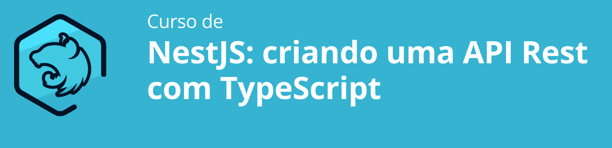

# NestJS (Primeiras Impressões)

O Objetivo deste curso é desenvolver uma API simples com a utilização do framework NestJS e TypeScript. Trabalho baseado no curso da Alura sobre o tema.



## Conhecendo o NestJS

1. Instalando o NestJS
  ```
  npm i -g @nestjs/cli
  ```

2. Inicializando nosso projeto
  ```
  nest new produtos-api
  ```

3. Removendo diretórios desnecessários

4. Criando o controller src/produtos.controler.ts

5. Implementando os Métodos GET | POST | PUT | DELETE

6. Testando as rotas api.http

## Models

1. Implementando os Models src/produtos.model.ts

2. Criando dados estáticos para nossos produtos

3. Fazendo que nossos controllers consumam e retornem nossos produtos.

## Services

1. Criando o Service src/produtos.service.ts

2. O Nest utiliza o conceito de providers (classes que podem ser injetadas dentro de outras),
assim adicionamos ao nosso service o decorator @Injectable

3. Refatorando o controller de produtos

4. Inserido o ProdutosService no arquivo src/app.module.ts na opção provider.

5. Injeção de Dependência : Coloca na classe que se pretende injetar o decorator @Injectable
e no módulo principal onde iremos utilizar no array de providers devemos importar aquela classe. (Inspirado no Angular).

Injeção de dependência é um padrão de projeto que auxilia a manter um baixo padrão de acoplamento entre classes. No nosso caso delegamos a responsabilidade de criar e fornecer um objeto para o framework.

## Integração com o banco de dados

1. Busca na documentação do NestJS o módulo Sequelize.

2. Instalando o Sequelize
  ```
  npm install --save @nestjs/sequelize sequelize sequelize-typescript mysql2
  npm install --save-dev @types/sequelize
  ``` 
3. Configurando o banco de dados src/app.module.ts

4. Adequando o Model para o Sequelize src/produtos.model.ts

5. Rodando o projeto, criando a tabela e os campos.

## Alterando o Service e configuração final do projeto.

1. Alterando o Service src/produtos.service.ts

2. Configurando o Controller

3. Inserindo dados no banco.

4. Testes finais com um CRUD completo.

5. Modificando as configurações do projeto (pacote vindo dotenv - nodejs)
  ```
  npm i --save @nestjs/config
  ```
- No arquivo src/app.module.ts colocar a configuração ConfigModule.forRoot()
- Criar o arquivo .env na raiz do projeto


